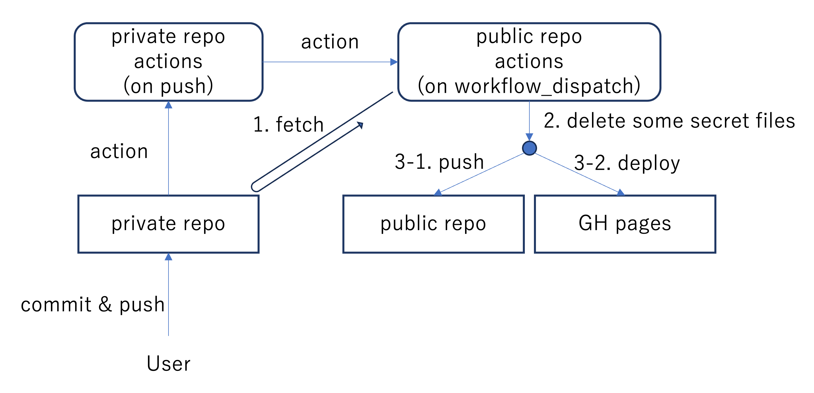

# PrivateレポジトリにPushするとPublicレポジトリに一部がコピーされ、GitHub PagesにデプロイするPoC

↑のとおりです。

* public repository: [pushtopub_public](https://github.com/cysec-lab/pushtopub_public)
* private repository: [pushtopub_private](https://github.com/cysec-lab/pushtopub_private)



## private action file

pushtopub_private/.github/workflows/action.yaml

```yaml
name: Action Trigger
on:
  push:
    branches:
      - main

jobs:
  deploy:
    name: Deploy
    runs-on: ubuntu-latest
    steps:
      - uses: actions/checkout@v3
      - uses: convictional/trigger-workflow-and-wait@v1.6.5
        with:
          owner: cysec-lab    # change this
          repo: pushtopub_public # change this
          github_token: ${{ secrets.ORG_GITHUB_PAT }}
          workflow_file_name: deploy.yaml
          propagate_failure: true
```
